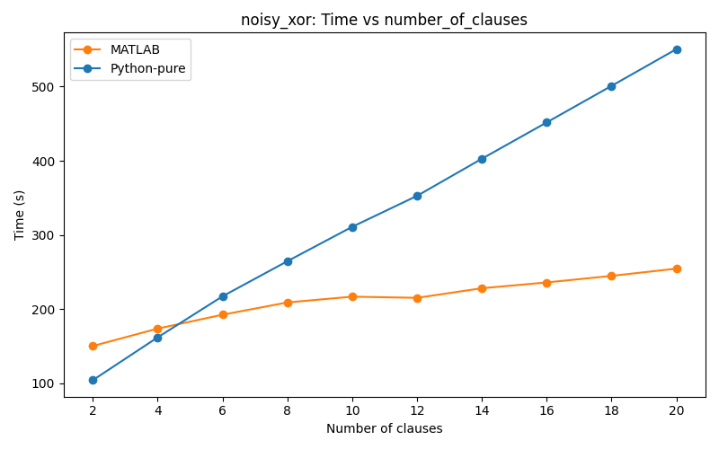
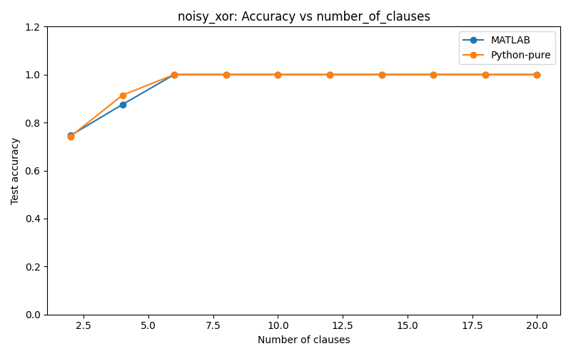
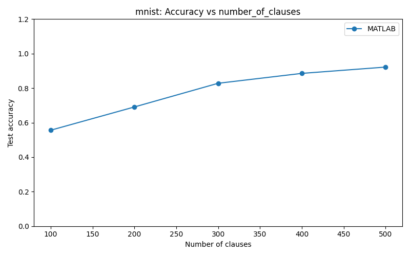

# Performance Study of Tsetlin Machine: MATLAB vs Pure Python vs Python+C-extension

A controlled benchmarking study of the **Tsetlin Machine** algorithm across three implementations (MATLAB, Pure Python, Python+C-extension) on **MNIST**, **Normal XOR**, and **Noisy XOR** — quantifying speed, scaling, and accuracy trade-offs across **241 experiment runs**.

---

## Key Findings

### 1. Pure Python vs MATLAB — apples-to-apples (interpreted vs interpreted)

Across **150 controlled runs** (75 per language) on Normal XOR and Noisy XOR with sweeps over 2–20 clauses at 200 / 500 epochs:

- **MATLAB scales better** as clause count grows. On Noisy XOR, MATLAB runtime grew only **1.7×** from 2→20 clauses, while Pure Python grew **5.3×**.
- **Pure Python is faster at small clause counts** (2–4 clauses) but crosses over to slower beyond ~6 clauses.
- **Both implementations are algorithmically equivalent**: both reach **100% test accuracy at 6 clauses on Noisy XOR** and **12 clauses on Normal XOR** (500 epochs), with accuracy variance under 1% across all configurations.

| Clauses (NoisyXOR, 500 epochs) | MATLAB time (s) | Pure Python time (s) | Ratio |
|---|---|---|---|
| 2 | 150.3 | 104.3 | **0.69×** (Python faster) |
| 6 | 192.5 | 217.3 | 1.13× |
| 10 | 216.8 | 311.0 | 1.43× |
| 20 | 254.6 | 550.5 | **2.16×** (Python slower) |





### 2. Python + C-extension — a note

A Python + C-extension implementation is also included in this repo (`TsetlinMachine-master/`). It was run on both Noisy XOR and MNIST and produced results consistent with the other implementations in terms of accuracy. However, these runs were not conducted under the same controlled environment as the MATLAB vs Pure Python comparison above, so no direct timing claims are made here. It exists as a practical reference for anyone who needs a faster implementation for larger-scale experiments.

### 3. MNIST scaling (MATLAB only)

The Pure Python implementation was infeasible on MNIST — a single run at higher clause counts exceeded **a week of compute** without converging. MATLAB was the only implementation run to completion on MNIST. Across 5 clause configurations (100–500) at 200 epochs:

- **~92% test accuracy** at 500 clauses (200 epochs)
- Accuracy improves monotonically from ~55% (100 clauses) → ~92% (500 clauses)



---

## Why this study?

Most public Tsetlin Machine references publish a single implementation in isolation. This project asks a practical engineering question: **for the same algorithm, what does the implementation language actually cost you in time, scaling, and final accuracy?**

The answer matters when choosing a research stack — MATLAB is common in academia for prototyping, but if your experiments need to scale to MNIST-size data, the choice has real compute consequences.

---

## What's in this repo

```
DataSet/                       # MNIST, NoisyXOR, NormalXOR (preprocessed)
MATLAB/                        # MATLAB demos: MNIST.m, NoisyXOR.m, NormalXOR.m
TsetlinMachine-master/         # Python + C-extension implementation
TsetlinMachine-purePython/     # Pure Python reference implementation
result/                        # Aggregated CSV logs and comparison plots
plot_results_all.py            # Automated plotting pipeline
```

**Experiment scope:**
- 241 total runs across 3 implementations × 3 datasets
- Hyperparameter sweeps over: clauses, epochs, T (threshold), s (specificity), TA states
- Per-epoch CSV logging for full reproducibility
- Automated comparison plots via `plot_results_all.py`

---

## How to Use

### Prerequisites

- MATLAB R2019b+ (with `-batch` support for CLI runs)
- Python 3.8+
- `pip install numpy pandas matplotlib`

### Quick Start

Run a fast sanity-check XOR demo:

```bash
cd TsetlinMachine-purePython
python NoisyXORPure.py --clauses 10
```

Run MNIST with the C-extension:

```bash
cd TsetlinMachine-master
python MNISTDemo.py --clauses 100
```

Run the same problem in MATLAB:

```bash
cd MATLAB
matlab -batch "MNIST('clauses',100)"
```

Generate comparison plots from results:

```bash
python plot_results_all.py
```

### Sweeping clause ranges

Windows `.bat` helpers for parameter sweeps:

**MATLAB** (from `MATLAB/`):
```bat
run_mnist_dynamic.bat START STEP END
run_noisy_xor_dynamic.bat START STEP END
run_normal_xor_dynamic.bat START STEP END
```

**Python + C-extension** (from `TsetlinMachine-master/`):
```bat
run_mnist_dynamic.bat START STEP END
run_noisy_dynamic.bat START STEP END
```

**Pure Python** (from `TsetlinMachine-purePython/`):
```bat
run_mnist_pure.bat START STEP END
run_noisy_xor_pure.bat START STEP END
run_normal_xor_pure.bat START STEP END
```

### Hyperparameters

All demos expose the same core hyperparameters:

| Parameter | Default | Effect |
|---|---|---|
| `clauses` | 10–500 | Model capacity. More clauses → higher accuracy, more compute. |
| `T` (threshold) | 15 | Vote-clipping ceiling. Higher allows more clause votes before saturation. |
| `s` (specificity) | 3.9 | Feedback probability. Lower → more specific clauses. |
| `states` | 100 | Tsetlin Automaton confidence granularity. |
| `epochs` | 200 | Full passes over training set. |

Pass via CLI (Python) or function args (MATLAB):

```bash
python MNISTDemo.py --clauses 400 --T 25 --s 3.5 --states 200 --epochs 300
matlab -batch "MNIST('clauses',400,'T',25,'s',3.5,'states',200,'epochs',300)"
```

---

## Results & Logs

- Per-epoch logs: `*/result/<task>/epoch_log_YYYYMMDD_HHMMSS.csv`
- Summary logs: `*/result/*_result_log.csv` (these were used for all findings above)
- Plots: `result/<dataset>/plots/`

Most generated `result/` content is git-ignored. The summary CSVs are tracked so the findings are reproducible from the data.

---

## Honest caveats

- **Pure Python on MNIST was not run to completion** — high clause counts exceed practical compute time on a single machine. The MATLAB-vs-Pure-Python comparison is therefore strongest on the XOR datasets.
- **Hardware was held constant** across runs but is a single-machine setup; absolute times will differ on other hardware. The *ratios* between implementations should remain stable.
- **Stochastic variance**: Tsetlin Machines are stochastic. Each (clause, epoch) configuration was run 3–4 times and averaged. A few configurations show notable variance (e.g., NormalXOR @ 14 clauses) and are flagged in the summary CSVs.

---

## Author

**Peeraphat Naowasaisee** — Final-year Computer Engineering, RMUTT
[GitHub](https://github.com/PeeraphatN) · contactpeeraphat.n@gmail.com
